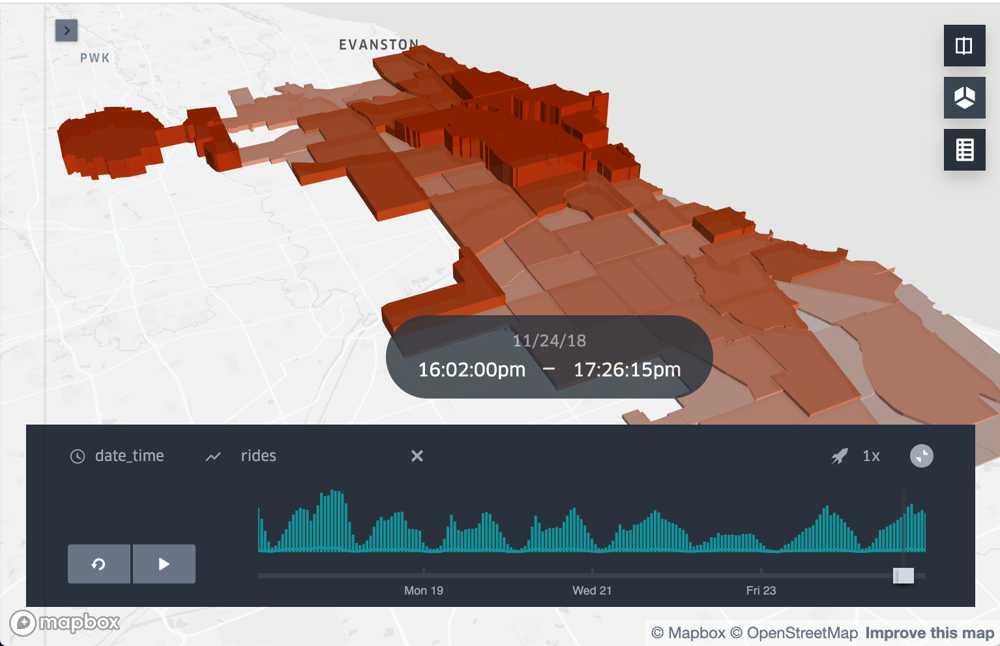

# Forecasting Demand for Ridshare Companies

#### -- Project Status: [Completed]

## Project Objective

This project aims to help rideshare providers forecast demand, aiming to increase ridership and reliability for customers. The data was retrieved from the [Chicago Data Portal](https://data.cityofchicago.org/Transportation/Transportation-Network-Providers-Trips/m6dm-c72p) 

### Methods
* Querying Data:
    * Pulling data from Socrata Open Data Portal
* Cleaning Data:
    * grouping by timeframes, computing null values
* Time Series Modeling:
    * gathering trends of data to forecast
* Plotting:
    * visualizing data and forecast results
* Multi-Core Processing:
    * utilizing all cores to improve run-time of calculations

### Including Packages
* requests - query SODA database
* pandas - loading and pre-processing data
* matplotlib, seaborn - plotting results
* statsmodels, pmdarima - time series modeling
* kepler.gl - geospatial visualizations

## Project Description
This project is broken down into four jupyter notebooks:

* #### query_clean:
    To start, using the SOCRATA platform, I grouped the data by ridership on a hourly basis, as the original file by ride is too large to hold on a local machine. I gathered information about my dataset, including days and hours of peak ridership, community areas with the highest ridership, and weather on a daily basis. These numbers improve understanding of the dataset, and help decision making for further modeling.
    
* #### city_modeling:
    This consists of running models on a 'city-wide' basis, to determine base scores and best model for the data. Tests include SARIMA, auto-SARIMA, and Holt-Winters' Exponential Smoothing. After optimizing parameters, I chose to continue with Holt-Winters' because of the superior speed, accuracy, and minimal computation needed.
    
* #### neighborhood_models:
    To develop accurate location informed decisions, I separated the data into individual community areas, and develop separate models, as demand differentiates for each. Modeling for each neighborhood is computationaly expensive, so incorporating multi-core processing brought modelin time from 1 hour to ~10 minutes. 
    
* #### kepler.gl
    The ultimate output of this project would be to visualize when and where demand was happening. Kepler as a tool was able to combine geospatial boundaries for community areas along with the time-series of ridership to accurately represent demand - viewable on this
[Live Dashboard](https://dancorley.com/chicago.html)

## Contact
* Feel free to contact me if any questions, or comments on the project - [hello@dancorley.com]